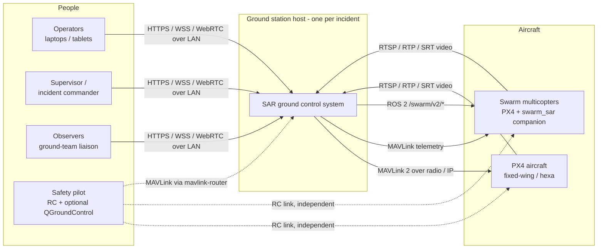
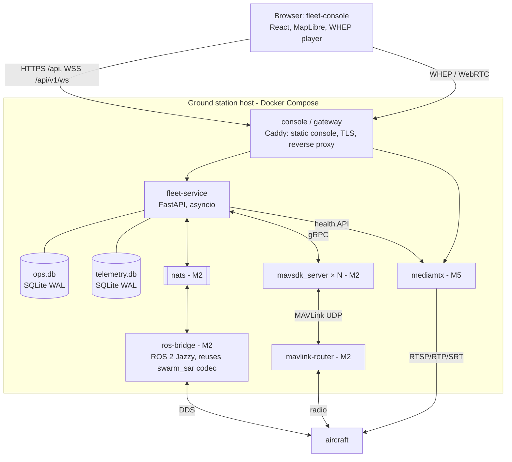
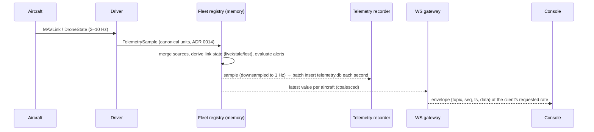

# Architecture

Ground control system for a civilian search-and-rescue drone fleet: up to 50 PX4 aircraft
(fixed-wing and hexacopters, some running the onboard `swarm_sar` companion), a few operators
with different roles, one field ground station, and no cloud. This page is the living overview.
The reasons behind it are in [`decisions/`](decisions/0001-record-architecture-decisions.md).

Status: **M1a**. The fleet service has its persistent domain, auth/RBAC, a hash-chained audit
trail and a REST API ([`api/README.md`](api/README.md)). The console is a shell. Everything
marked with a later milestone below is designed but not built yet. See
[`../PLAN.md`](../PLAN.md).

## System context



The aircraft's own failsafes remain the primary safety layer (ADR 0002, S1). The GCS supports
operators; it is never a single point of failure for flight safety.

## Containers



## Fleet service internals

```
api/        REST routers + WebSocket gateway          ── only layer that knows HTTP
services/   fleet registry (live state, link state), command dispatcher, control leases,
            alert engine, mission service, audit writer, telemetry recorder
domain/     pure, fully unit-tested logic: command rules & preconditions, search patterns,
            deconfliction, geo validation, units/frames
drivers/    VehicleDriver implementations: mock (M1), mavsdk (M2); swarm via bus (M2)
bus/        EventBus: in-process (M1), NATS (M2)
db/         SQLAlchemy models, repositories, Alembic migrations
auth/       accounts, sessions, permissions
```

Dependencies point downward. `domain/` imports none of the others, so it is testable
without I/O, just as the onboard `swarm_sar.core` imports neither ROS nor the simulator.

## Key flows

### Telemetry: aircraft to console



### Command: operator to aircraft

```mermaid
sequenceDiagram
  participant UI as Console
  participant API as Command API
  participant P as Pipeline
  participant D as Driver
  participant AU as Audit
  UI->>API: POST command {command_id, aircraft_ids, action}
  API->>P: authorize (permission, lease, capability) · preconditions
  alt risky or bulk
    P-->>UI: 428 + server summary + confirmation token
    UI->>API: same request + token (deliberate second action)
  end
  P->>AU: requested
  P->>D: execute (per aircraft, rate-limited)
  D-->>P: ack / nack(reason) / timeout
  P->>AU: outcome per aircraft
  P-->>UI: per-aircraft results; effect verified later from telemetry (mode change) or alert
```

## Budgets (verified in M5; the load tests fail if they are exceeded)

| Metric | Budget at 50 aircraft × 10 Hz, 6 consoles |
|---|---|
| Telemetry ingest → console, p95 | ≤ 250 ms (excluding radio latency) |
| Command accepted → dispatched, p95 | ≤ 100 ms |
| Link-state change → alert on console, p95 | ≤ 1 s after the threshold |
| Fleet-service CPU | ≤ 1 core average |
| Fleet-service RSS (excluding mavsdk_server processes) | ≤ 500 MB |
| Console map frame rate | ≥ 30 fps on the reference laptop |
| WebSocket bandwidth per console | ≤ 150 KB/s at the default coalescing rate |

## Failure behaviour

| Failure | Behaviour |
|---|---|
| Aircraft link degraded or lost | The link state goes to *stale* then *lost*, raising an alert. Only HOLD, RTL or LAND are accepted. The aircraft follows its own PX4 data-link-loss action. |
| Console disconnects | The lease is kept for 60 s, then *orphaned* and supervisors are alerted. The aircraft continue their task, and the GCS issues nothing automatically. |
| Fleet service crashes or restarts | The aircraft are unaffected. On restart, state is reloaded from `ops.db`, links reconnect and live state resyncs from the aircraft (M6). |
| NATS down (M2+) | Swarm bridge telemetry goes stale, raising an alert. Direct MAVLink aircraft are unaffected, because their drivers run in-process. |
| Disk full | Telemetry recording pauses with an alert, and operational writes keep a reserved margin (M6). |
| Clock skew | The server is authoritative, and consoles show skew above 2 s (implemented in M0). |
| Video relay down | Streams show *unavailable* with the reason, and flight control is unaffected. |

## Repository map

| Path | What |
|---|---|
| `fleet-service/` | Backend (Python, FastAPI). See its `README.md`. |
| `fleet-console/` | Operator console (React, TypeScript). See its `README.md`. |
| `deploy/` | Compose file and gateway config for the ground station |
| `sim/` (M2) | PX4 SITL / Gazebo / SIH harness, link emulator, mock video |
| `src/` | ROS 2 colcon workspace: the onboard `swarm_sar` packages (unchanged) and, from M2, `sar_gcs_bridge` |
| `docs/` | This page, ADRs, API specs (M1), runbooks |
| `scripts/check.py` | Runs every lint, type check, test and build |
